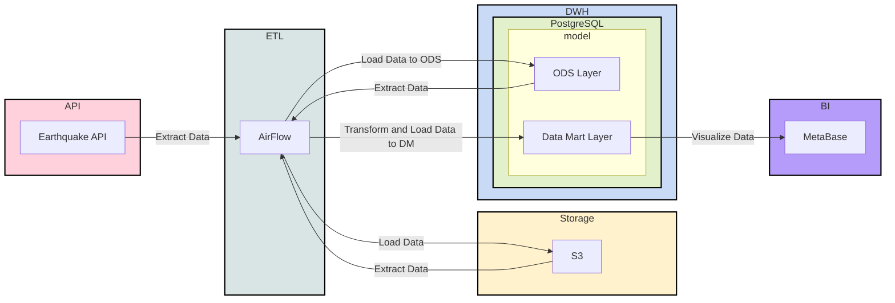

# Лучший пет-проект для дата-инженера (The best pet-project for a data-engineer)

> [!NOTE]
> **TL;DR** Заменил нерабочий Minio S3 на рабочий Silo S3. Проект снова актуален. Все изменения отображены в PR #1

> [!IMPORTANT]
> [Minio](https://github.com/minio/minio) ушел из OpenSource, но Docker-образы были доступны.<br><br>
> 2026-09-14 на Reddit был опубликован
пост — [MinIO just removed their DockerHub image](https://www.reddit.com/r/minio/s/KxwCW1gKNE).<br><br>
> Я не сижу на Reddit 24/7 и поэтому увидел пост не сразу. Узнал об этом когда получил сообщение по типу: "_проект не
работает_".
> Проинформировал, что в курсе проблемы в своем tg-канале — [пост](https://t.me/DataLikeQWERTY/194).
> <br><br>
> Исследовал аналоги, думал взять совсем что-то другое, что описывал в этом [посте](https://t.me/DataLikeQWERTY/150)
>, но решил остановить свой выбор на fork Minio — [PGSTY Silo](https://github.com/pgsty/silo).
> На текущий момент (2026-10-05) Minio заменен на Silo. Более подробно описано в PR #1 

В этом [видео](https://youtu.be/MQPHgUQvKnI) я покажу лучший пет-проект для дата-инженера, который можно добавить в свой
опыт. Вместе мы создадим
полноценную инфраструктуру: Apache Airflow, PostgreSQL, MinIO (S3), Metabase и Docker. Покажу, как организовать
пайплайны, DAG'и, витрины, использовать git и best practices для data engineering проектов.

📌 Что вы узнаете:

- Как устроена типовая задача дата-инженера
- Как создать рабочую инфраструктуру под pet project
- Как управлять зависимостями и конфигурацией
- Как создать витрины данных и визуализации
- Как применять подходы Data Governance

📂 Полный проект на GitHub: https://github.com/k0rsakov/pet_project_earthquake

👨‍💻 Подходит для начального уровня, junior и middle дата-инженеров, ищущих реальный опыт и сильное портфолио.

🔔 Подписывайтесь и ставьте лайк, если хотите больше практических видео!

Менторство/консультации по IT – https://korsak0v.notion.site/Data-Engineer-185c62fdf79345eb9da9928356884ea0
TG канал – https://t.me/DataLikeQWERTY
Instagram – https://www.instagram.com/i__korsakov/
Habr – https://habr.com/ru/users/k0rsakov/publications/articles/

Тайм-коды:
- 00:00 Начало
- 04:46 Непосредственно к ролику (описание проекта)
- 05:44 Типовая задача дата-инженера
- 08:38 Создание проекта в GitHub
- 09:37 Клонирование проекта
- 10:31 Изменение git-конфига
- 11:30 Создание виртуального окружения
- 13:48 Правила формирования коммитов в проекте
- 15:13 Создание инфраструктуры проекта (аирфлоу/AirFlow)
- 16:14 Создание инфраструктуры проекта (постгрес/PostgreSQL)
- 17:22 Создание инфраструктуры проекта (минио/Minio S3)
- 17:48 Рекомендации про работу с версиями
- 17:22 Создание инфраструктуры проекта (метабазе/Metabase)
- 22:00 Настройка минио/Minio S3 (создание бакета, ключей и пр)
- 23:48 Первый взгляд на аирфлоу/AirFlow
- 25:13 Первый DAG
- 25:20 Как именовать DAG
- 26:30 Добавление пакетов в виртуальное окружение
- 30:35 Объяснение логики DAG
- 33:25 Объяснение контекста DAG
- 40:25 Добавление python-пакета в сборку
- 41:22 Как работать с зависимостями в проекте
- 42:58 Добавление Variables в аирфлоу/AirFlow
- 44:10 Первый запуск DAG
- 45:20 Объяснение идемпотентности
- 47:05 Зависимости dag между собой в аирфлоу/AirFlow
- 47:25 Создание второго DAG
- 51:33 Создание схем и таблицы в постгрес/PostgreSQL
- 53:26 Объяснение типизации в постгрес/PostgreSQL (двх/dwh)
- 54:20 Первый запуск второго DAG
- 54:25 Просмотр зависимостей DAG
- 55:17 Просмотр данных в постгрес/PostgreSQL
- 56:00 Объяснение, что такое витрина
- 57:35 Создание первой витрины
- 01:01:53 Создание второй витрины
- 01:04:02 Создание подключение к постгрес/PostgreSQL в аирфлоу/AirFlow
- 01:04:50 Объяснение подключений в аирфлоу/AirFlow
- 01:05:50 Первый запуск первой витрины
- 01:06:05 Создание таблицы для первой витрины
- 01:08:05 Просмотр идемпотентности для первой витрины
- 01:08:47 Первый запуск второй витрины
- 01:09:00 Просмотр зависимостей DAG в проекте
- 01:09:52 Создание таблицы для второй витрины
- 01:11:28 Создание визуализаций в метабазе/Metabase
- 01:16:10 Пояснение наших этапов, что мы сделали в этом проекте
- 01:16:25 Разбор проекта в разрезе Data Governance
- 01:17:38 1. Data Architecture
- 01:17:44 2. Data Modeling & Design
- 01:18:18 3. Data Storage & Operations
- 01:19:34 4. Data Security
- 01:20:03 5. Data Integration & Interoperability
- 01:20:26 6. Documents & Content
- 01:20:41 7. Reference & Master Data
- 01:22:18 8. Data Warehousing & Business Intelligence
- 01:24:55 9. Meta-data
- 01:25:31 10. Data Quality
- 01:28:20 Прощание


#dataengineer #petproject #airflow #postgresql #minio #metabase #dwh #python #dataengineering #etl #docker #portfolio
#датаинженер

## Создание виртуального окружения

```bash
python3.12 -m venv venv && \
source venv/bin/activate && \
pip install --upgrade pip && \
pip install -r requirements.txt
```

## Разворачивание инфраструктуры

```bash
docker-compose up -d
```

## Ссылки

- [Лучший пет-проект для дата-инженера (The best pet-project for a data-engineer)](https://youtu.be/MQPHgUQvKnI)
- [Описание работы API](https://earthquake.usgs.gov/fdsnws/event/1/#methods)
- [Описание полей из API](https://earthquake.usgs.gov/data/comcat/index.php)
- [airflow docker-compose](https://airflow.apache.org/docs/apache-airflow/2.10.5/docker-compose.yaml)

## Data Governance


### 1. Data Architecture

Lakehouse



### 2. Data Modeling & Design

Не применяется звезда, снежинка или другое, потому что в этом нет необходимости. Данных немного. Состояние измениться не
может, поэтому создаём модель по типу "_AS IS_".

### 3. Data Storage & Operations

#### Storage

Cold, Warm Storage – S3
Hot Storage – PostgreSQL

#### Compute/Operations

DuckDB – Data Lake
PostgreSQL – DM layer

### 4. Data Security

Безопасность настраивается на уровне пользователей в S3 и ролевой модели в PostgreSQL. В Airflow задаётся безопасность
через роли.

Здесь может быть использован LDAP

### 5. Data Integration & Interoperability (Интеграция данных и совместимость)

В данном случае не занимаюсь этим пунктом, потому что для демонстрации и текущей реализации достаточно, но для
"правильной" работы необходимо ods слой "_приводить_" к нужным типам.

К примеру, сейчас:

```sql
...
time varchar
...
```

А нужно:

```sql
...
time timestamp
...
```

### 6. Documents & Content

Документация в виде видео, дополнительно могут быть комментарии, описание на внутренних ресурсах и прочее

### 7. Reference & Master Data

В данном случае у нас данные, которые находятся в Data Lake S3, являются "_золотыми_". Мы их взяли из источника "_как есть_"
и не модифицируем, тем самым вероятность их потерять в нашем пайплайне равно 0%. Но это не говорит, что изменение данных
невозможно/запрещено. Разрешено в других "_слоях_", на уровне dwh или в своих реализациях.

### 8. Data Warehousing & Business Intelligence

Как было сказано выше "_горячее_" хранение у нас в PostgreSQL.

Для BI-системы мы используем Metabase.

Из общих рекомендаций по данному пункту:

1) Задавать "_жизнь_" для витрин. Потому что сейчас бизнесу нужна витрина `N`, а через месяц нет. И чтобы она не крутилась
   просто так необходимо проводить "уборки".
2) Определить роли для отчётов и допустимых зон. К примеру C-уровень должен видеть Все отчёты. А уровень курьеров не
   должен видеть витрины по опционам и выручке компании
3) Сформировать правила формирования витрин
    1) Один показатель – одна витрина
    2) Один показатель – одна вью/мат.вью
    3) Широкая витрина
    4) Одна таблица, которая содержит все показатели и её вид примерно такой: дата-день, тип показателя, значение
4) Мониторинг активности и нагрузка
5) Автоматическое обновление. Исключить "_ручной_" труд

### 9. Meta-data

Сейчас мета-данных нет, но их можно задать к примеру через комментарии к столбцам в DWH.

Вот к примеру описание всех колонок – [Описание полей из API](https://earthquake.usgs.gov/data/comcat/index.php)

Для уровня Data Lake явно должны быть свои инструменты для формирования мета-данных.

Тут необходимо искать удобный для вашей команды дата-каталог: OpenMetaData, DataHub и прочее.

### 10. Data Quality

Дата кволити сейчас нет. Потому что опять же долго реализуется и это большая тема. Возможно ей будет посвящено отдельное
видео, если поддержите лайком.

Но из основного:

1) Нужно смотреть "_долетели_" ли данные (ACID).
2) Смотреть SLA доставки данных
3) Определить важные дашборды. И повешать разные алерты на них.
4) Стараться при возможности смотреть на "источник". Условно Если у на источнике 1000 строк, а у нас в Data Lake/DWH 999
   строк мы должны узнать об этом сразу, а не через месяц.
5) Нужен процесс, который позволит исправлять такие ошибки
6) Если витрина Очень важная, то проводить свои тесты перед попаданием их на прод. Смотреть на дельту между значениями,
   смотреть на среднее значение и прочее. Критерии "качества" необходимо выяснять у бизнеса.

## Notes

SQL схемы:

```sql
CREATE SCHEMA ods;
CREATE SCHEMA dm;
CREATE SCHEMA stg;
```

DDL `ods.fct_earthquake`:
```sql
CREATE TABLE ods.fct_earthquake
(
	time varchar,
	latitude varchar,
	longitude varchar,
	depth varchar,
	mag varchar,
	mag_type varchar,
	nst varchar,
	gap varchar,
	dmin varchar,
	rms varchar,
	net varchar,
	id varchar,
	updated varchar,
	place varchar,
	type varchar,
	horizontal_error varchar,
	depth_error varchar,
	mag_error varchar,
	mag_nst varchar,
	status varchar,
	location_source varchar,
	mag_source varchar
)
```

DDL `dm.fct_count_day_earthquake`:

```sql
CREATE TABLE dm.fct_count_day_earthquake AS 
SELECT time::date AS date, count(*)
FROM ods.fct_earthquake
GROUP BY 1
```

DDL `dm.fct_avg_day_earthquake`:

```sql
CREATE TABLE dm.fct_avg_day_earthquake AS
SELECT time::date AS date, avg(mag::float)
FROM ods.fct_earthquake
GROUP BY 1 
```
